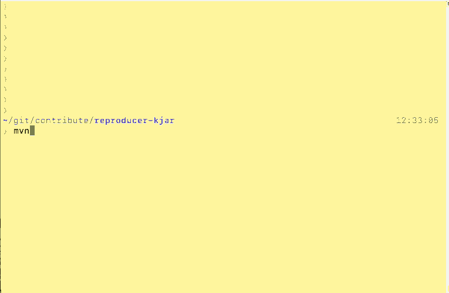

# How to start contributing to Drools Executable Model

## What is the Executable Model?

The Executable Model is a new way to execute business rules in Drool. 
It's based on a Java representation of the rule structures that provides a few advantages such as faster startup time and better memory allocation at runtime.
You can check out the details in the [Drools Documentation](https://docs.jboss.org/drools/release/7.55.0.Final/drools-docs/html_single/index.html) or in other blog posts such as [Mario's](https://blog.kie.org/2021/06/profiling-and-optimizing-executable-model-generation.html).

KJARs built with the `kie-maven-plugin` have the Executable Model enabled since 7.33.0.Final by default and it's the main technology underneath [Kogito](https://kogito.kie.org). 
With the "Executable Model Compiler", a module you can find in the  `drools-model-compiler` directory, DRL files are transformed into a Java DSL.

## How to start contributing

Drools is a really big open source project, and finding the best way to contribute to it might not be easy.
Luckily, the Executable Model Compiler is a good way to start, for various reasons:

* It's a fairly new project (as today it's been more or less three years since the inception)
* It doesn't require deep understanding of the Drools' internal algorithm, PHREAK
* There always is a former counterpart to verify the code against 

Regarding the third point, we want to make sure that Drools is behaving in the exact same way while using the former runtime (also called `DRL`) and the new one (called `PatternDSL`).

## Contributing: showing a problem 

Imagine that you're interested in contributing to Drools, what should you do when you find a problem and you think it's related to the Executable Model? 

Firstly we should understand where the problem is in Drools and if it's eventually related to the Executable Model.
To do that, we need to create the smallest piece of code that shows the problem: this is what we called a "bug reproducer" (also just "reproducer"). 
If you provide a bug report to [Zulip](https://blog.kie.org/2020/04/new-community-channels-on-zulip-chat.html), mailing lists or [Stack Overflow](https://drools.org/community/getHelp.html)
the team will ask you to create such reproducer. There are two ways to do it:

1) If you're familiar with the [Drools GitHub repository](https://github.com/kiegroup/drools) you can write the test directly in your own fork of the original repository and create a PR against it. 
   This is probably the best way to proceed, as it allows all the Drools' developers to check the problem faster
2) Create another separate project that shows the problem

## Method #1: create a reproducer in drools.git

Start by building the Drools project reading the [Drools Source Code](https://drools.org/code/sourceCode.html) page.

You can either decide to build it using [droolsjbpm-build-bootstrap](https://github.com/kiegroup/droolsjbpm-build-bootstrap/blob/master/README.md) or building only the [Drools](https://github.com/kiegroup/drools) module with `mvn clean install`. The second one is definitely faster.

Once you have the project up and running you can open it with your preferred IDE and take a look at the tests in the `drools-model-compiler` module, for example `org.drools.modelcompiler.CompilerTest`. 

If you run these tests you'll see they're executed twice, once against the `DRL` mode and the other against the `PatternDSL`. It's important that the tests run in both ways. If you see a difference in the execution, please create a PR. And if you want to fix it on your own, try - we love to see new contributors.

## Method #2: create a self contained project

Let's use the Drools archetype and verify that your small reproducer is working against Drools Legacy. 

Start by creating a KJAR using the [Maven Archetype](https://mvnrepository.com/artifact/org.kie/kie-drools-archetype), modify the rules and the test to verify everything is working accordingly. The default archetype will run the test against the DRL mode.

Change the generated model to build an executable model KJAR. To do so, switch in the `pom.xml` from `drools-engine-classic` to `drools-engine`. Also add the `drools-model-compiler` dependency.

Compile the project using maven and the command line. Use 

`mvn clean install -DskipTests=true` 

as it'll try run the tests using the classic engine but we don't have the `drools-mvel` dependency in the class path anymore.



Verify the Executable Model has been built in the KJAR, you can for example using the command

`jar -tf target/name_of_the_kjar.jar`

And you'll see all the Executable Model classes under and the `drools-model` file. 
Another way to do it is to check the maven log for this phrase:

```

[INFO] Found 7 generated files in Canonical Model
[INFO] Generating /Users/lmolteni/git/contribute/reproducer-kjar/target/generated-sources/drools-model-compiler/main/java/./org/example/P41/LambdaExtractor41A2683D222972683028514525A5437B.java
...

```

Create another project called `runner` that has the original project as a dependency in the Maven `pom.xml`. 
The same archetype can be used again, but you have to change a few things

- Remove all the classes in `src/main/java`
- Remove the DRL files, as this project only consumes KJARs
- Remove the `kmodule.xml` file  
- Remove the `kie-maven-plugin` from the build. Again, we don't want to build KJARs here, only to use them.
- Switch in the `pom.xml` from `drools-engine-classic` to `drools-engine`.
- Remove the `kjar` packaging in pom.xml   
- Add the original KJAR dependency

```xml
    <dependency>
      <groupId>org.example</groupId>
      <artifactId>reproducer-kjar</artifactId>
      <version>1.0-SNAPSHOT</version>
    </dependency>
```

- Move the test from the original reproducer to this module
- Never call `kContainer.verify();` while using Executable Model KJARs as this will retrigger the build


Run the test. This time the test will run using the Executable Model.


You can see it because there will be this line in the logs

```
2021-06-15 11:32:29,576 INFO  [org.drools.modelcompiler.CanonicalKieModuleProvider] (main) Artifact org.example:reproducer-kjar:1.0-SNAPSHOT has executable model
```

This can probably be abstracted in a new archetype, let us know if you're interested and we can work of it. 

## Summary

In this article, we saw how to provide a small reproducer to verify an unexpected behaviour in Drools Executable Model and to provide the developers some way to verify the unexpected behaviour. 

Please try and contribute to Drools Executable Model!
